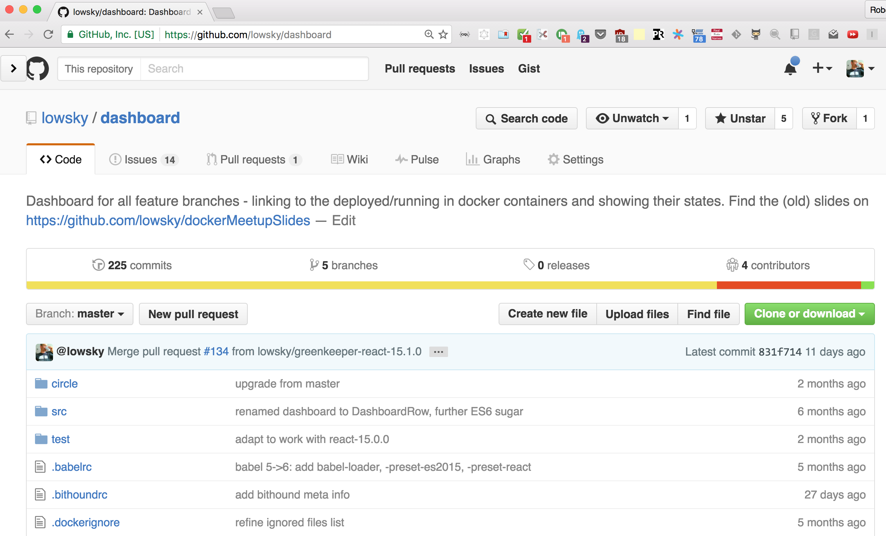
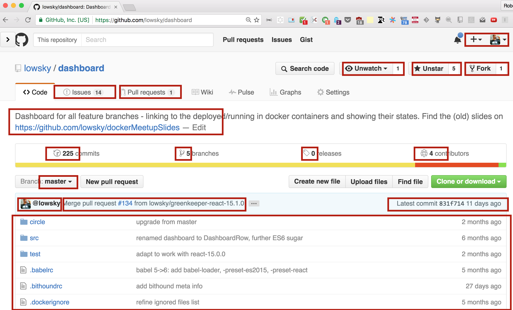

# Introduction

* "My experience with a monolithic frontend web app..."
* "Be creative, again!"


## What is data-binding
 

 [docs.angularjs.org/guide/databinding](https://docs.angularjs.org/guide/databinding)

Angular, Ember, Meteor:  M V C

Note:
["Data binding code in 9 JavaScript frameworks"](http://engineering.paiza.io/entry/2015/03/12/145216)


# What is wrong with MVC


# What about React?
  <!-- .element: style="height:10em" -->

*no data-binding*


## The React way: composition
```javascript
let modelData = {
    name: 'enterjs'
};
ReactDOM.render(<HelloWorld world={ modelData } />, domElement);

let HelloWorld = React.createClass({
  render: () => { return (<Hello name={ this.props.world.name } />) }
})
let Hello = new React.createClass({
  render: () => { return (<span>Hello, { this.props.name } ! </span>) }
})
```

gives

```html
<span>Hello, enterjs !</span>
```
Note:
  composition,
  props / state


## Flux

*separation of concerns*

even better: Redux...


## What is wrong with REST?








## What is wrong with using REST?
 * one resource = one request -> many requests
 * only *one* representation for different devices
 * n+1 / paging
 * have each end-point *documented*
 * *all* or *nothing*
 * custom end points for 'ad-hoc' special data

Note:
### More problems arise:
* When the apps grow -> things getting more complex
* inter-dependencies grow
* hard to maintain
* stay backwards compatible
