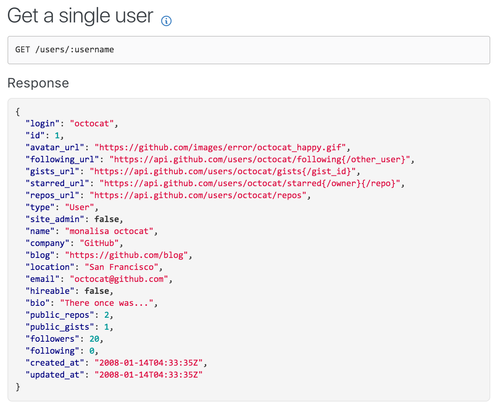

## Let's talk about REST!

Note:
## What is wrong with REST?
Nothing.
But, ...
 
* Architectural Styles and the Design of Network-based Software Architectures,
* Fielding's doctoral dissertation, describes Representational State Transfer (REST)
* http://www.anchor.com.au/blog/2013/02/how-everyone-is-doing-rest-wrong/

Let's build a web client

Every component need some data

GitHub API example

## Issues when using REST
 * *all* or *nothing*: **over-fetching**
 * only one resource per request => **many extra requests**
 * workaround: custom end points => **adds complexity** 

## There is no backend nor frontend team

Note:
 * **documentation** for each end-point
 * only **one representation** - for different devices
 * **paging** 

### More problems arise:
* When the apps grow 
* -> things getting more complex
* -> inter-dependencies grow
* hard to maintain on server and client - dependencies
* backward compatibility
 
