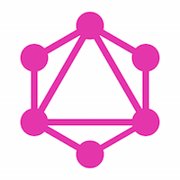
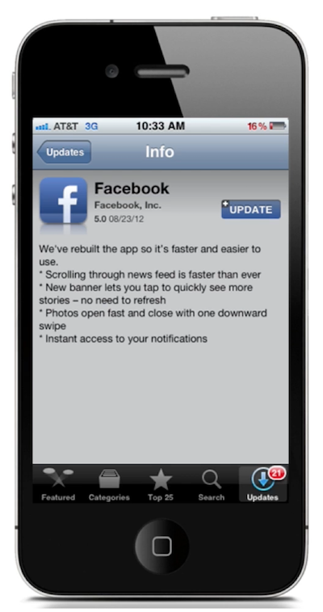
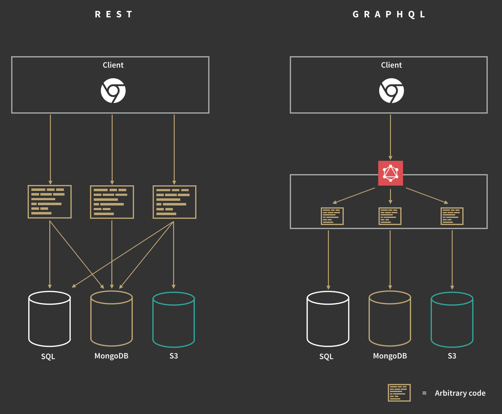
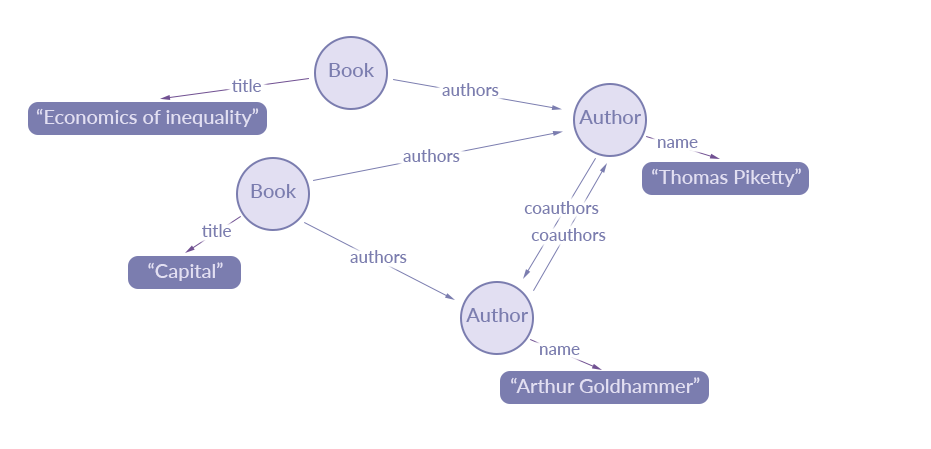

# GraphQL



> since 2012:
>
> "As a user of the native facebook iOS or Android app, 
> you are using an app **powered by GraphQL**."




# What is it?


**Centralized data Provider**


Note:

<a href="https://cdn-images-1.medium.com/max/1600/1*f_XvFD7FvliMM74WHJ0vRQ.png" data-preview-link="true"></a>
> https://cdn-images-1.medium.com/max/1600/1*f_XvFD7FvliMM74WHJ0vRQ.png)


## Data Graph



## "Query Language for the web"

<table width="100%">
<tr>
<td>
GraphQL Query:
<pre>
<code class="javascript">query {
    githubUser(id:"lowsky") {
        login
        name
        company
        location
        created_at
    }
}
</code>
JSON without 'values'
</pre>
</td>
<td>
Result:
<pre>
<code class="json">{
    "githubUser": {
      "login": "lowsky",
      "name": "Robert Hostlowsky",
      "company": "codecentric AG",
      "location": "Munich, Germany",
      "created_at": "2010-03-07T20:50:06Z"
    }
}
</code>
simple JSON
</pre>
</td>
</tr>
</table>


## *Graph*-QL
Aka. "Nested rpc", hierachical

```javascript
{
  github {
    user(username: "lowsky") {
      login
      repos {
        name
        commits(limit: 1) {
            message date
            author {
                login
            }
        }
        issues(limit: 1) {
            title user {
                id
            }
        }
      }
    }
  }
}
```


### Graph-QL: tree based 
```json
{
    "github": {
      "user": {
        "login": "lowsky",
        "repos": [
          {
            "name": "deck-graphql-relay-talk",
            "commits": [
              {
                "message": "Initial commit",
                "date": "2016-05-06T15:49:05Z",
                "author": {
                  "login": "lowsky"
                }
              }
            ],
            "issues": []
          },
          {
            "name": "dashboard",
            "commits": [
              {
                "message": "Merge branch 'master' of https://github.com/lowsky/dashboard",
                "date": "2016-05-13T15:59:11Z",
                "author": {
                  "login": "lowsky"
                }
              }
            ],
            "issues": [
              {
                "title": "react-dom@15.1.0 breaks build",
                "user": {
                  "id": 14790466
                }
              }
            ]
          }
        ]
      }
    }
}
```

Note:
## GraphQL Base
* **Client-specified queries** ("only what the client needs")
 
## There is more cool stuff:
* _Strongly-typed_ (schema definition)
* Introspective (tools can look into the schema)
* Structured, Arbitrary Code (queries backed by any code, not only SQL)

...Note: there is more:
* Product-centric (driven by view, "fetch only what is needed")
* Backwards Compatible
* Application-Layer Protocol (independend of http/any...)


## Schema definition: Type system
```json
{
  "name": "GithubUser",
  "fields": [
    {
      "name": "id",
      "type": { "name": "Int" }
    }, {
      "name": "name",
      "type": { "name": "String" }
    }, {
      "name": "repos",
      "type": { "kind": "LIST" } 
    }
  ]
}
```

```javascript
// flow - type definition:
type Album {
  name: String
  image_url: String
  tracks: [Track]
}
type Track {
  name: String
  preview_url: String
  artists: [Artists]
  track_number: Int
}

```


## Mutations

```javascript
mutation UserManagementAPI {
  addUser(input: {login: "user", name: "Mr.Robot 2"}) {
    account {
      login
      name
      creation_date
      id
    }
  }
}
```


## Huge Ecosystem
<a href="https://github.com/chentsulin/awesome-graphql#lib" data-preview-link="true">https://github.com/chentsulin/awesome-graphql#lib</a>


## Server implementations
* [Schema from Postgresql database](https://github.com/calebmer/postgraphql)
* [Schema from graffiti-mongoose](https://graffiti-todo.herokuapp.com/) (Example Relay TodoMVC application)

* [Graphene, graphql backend in python](http://graphene-python.org/)
* [graphql backends in _scala, rails, node, etc_](https://github.com/steveluscher/zero-to-graphql)


## extra tools for devs
* IntelliJ plugin
* _mock server_: graphql-tools for easy testing (by apollo people)
* [Chrome extension for graphql-network](https://chrome.google.com/webstore/detail/graphql-network/igbmhmnkobkjalekgiehijefpkdemocm)
* [graphql-cheat-sheet](https://raw.githubusercontent.com/sogko/graphql-shorthand-notation-cheat-sheet/master/graphql-shorthand-notation-cheat-sheet.png)
