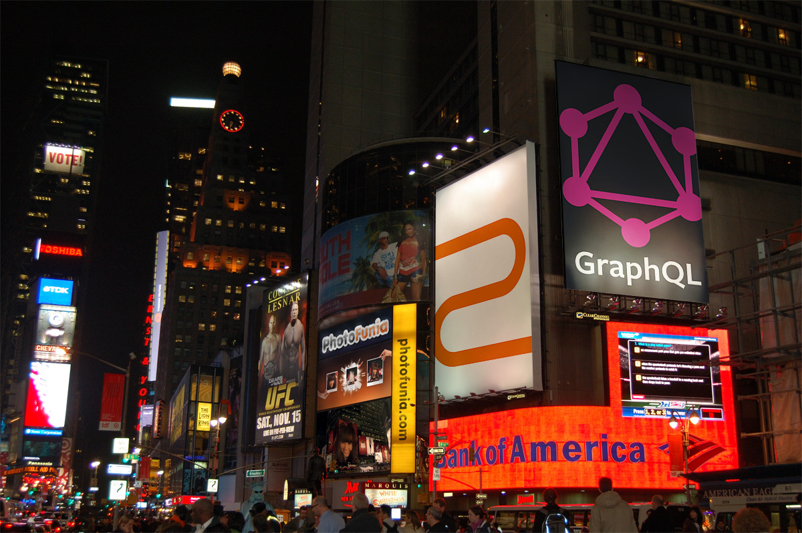
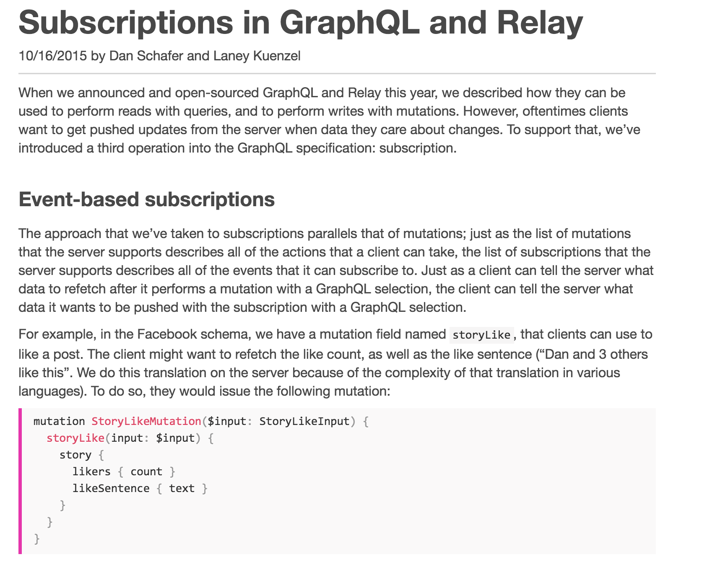

# GraphQL





> since 2013:
>
> "As a user of the native facebook iOS or Android app, you are using an app **powered by GraphQL**."


# What is it?


**Centralized data provider**

 <!-- .element: style="height:10em" -->

Note:
from
https://medium.com/apollo-stack/how-do-i-graphql-2fcabfc94a01
Jonas Helfer


> https://cdn-images-1.medium.com/max/1600/1*f_XvFD7FvliMM74WHJ0vRQ.png)


## "Query Language for the web"
Similar to JSON, but without 'values'

```javascript
{
    githubUser(id:"lowsky") {
        login
        name
        company
        location
        created_at
    }
}
```


## Query result:

```json
{
    "githubUser": {
      "login": "lowsky",
      "name": "Robert Hostlowsky",
      "company": "codecentric AG",
      "location": "Munich, Germany",
      "created_at": "2010-03-07T20:50:06Z"
    }
}
```
simple JSON


## *Graph*-QL
Aka. "Nested rpc", hierachical

```javascript
{
  github {
    user(username: "lowsky") {
      login
      repos {
        name
        commits(limit: 1) {
            message date
            author {
                login
            }
        }
        issues(limit: 1) {
            title user {
                id
            }
        }
      }
    }
  }
}
```


```json
{
    "github": {
      "user": {
        "login": "lowsky",
        "repos": [
          {
            "name": "deck-graphql-relay-talk",
            "commits": [
              {
                "message": "Initial commit",
                "date": "2016-05-06T15:49:05Z",
                "author": {
                  "login": "lowsky"
                }
              }
            ],
            "issues": []
          },
          {
            "name": "dashboard",
            "commits": [
              {
                "message": "Merge branch 'master' of https://github.com/lowsky/dashboard",
                "date": "2016-05-13T15:59:11Z",
                "author": {
                  "login": "lowsky"
                }
              }
            ],
            "issues": [
              {
                "title": "react-dom@15.1.0 breaks build",
                "user": {
                  "id": 14790466
                }
              }
            ]
          },
          {
            "name": "updtr",
            "commits": [
              {
                "message": "Update package.json",
                "date": "2015-12-08T23:29:19Z",
                "author": {
                  "login": "matthaias"
                }
              }
            ],
            "issues": []
          }
        ]
      }
    }
}
```


## GraphQL Features
* **_Hierarchical_ (embedding sub queries)**
* **Client-specified queries** ("only what the client needs")
* _Strongly-typed_ (schema definition)
* Introspective (tools can look into the schema)

Note: there is more:
* Product-centric (driven by view, "fetch only what is needed")
* Backwards Compatible
* Structured, Arbitrary Code (queries backed by any code, not only SQL)
* Application-Layer Protocol (independend of http/any...)


## Schema definition: Type system
```json
{
  "name": "GithubUser",
  "fields": [
    {
      "name": "id",
      "type": { "name": "Int", }
    },
    {
      "name": "name",
      "type": { "name": "String" }
    },
    {
      "name": "repos",
      "type": { "kind": "LIST" }
    }
  ]
}
```


### Schema inspection in Graph*i*QL


### Schema enables client-side tooling


## Use Structure, Arbitrary Code
```javascript
import {
  graphql,
  GraphQLSchema,
  GraphQLObjectType,
  GraphQLString,
  GraphQLNonNull
} from 'graphql';

const schema = new GraphQLSchema({
  query: new GraphQLObjectType({
    name: 'RootQueryType',
    fields: {
      search: {
        type: GraphQLString,
        args: {
          text: { type : new GraphQLNonNull(GraphQLString) }
        },
        resolve(root, args) {
          return 'Hello, ' + args.text;
        }
      }
    }
  })
});
```
Note:
 (queries backed by any code not only SQL)
 e.g. Hello 'cat':


### Running a query
```javascript
const query = `
  {
    search(text: "enterjs")
  }`;

graphql(schema, query).then(result => {
  console.log(result);
});
```
results in
```
Hello, enterjs
```


## Creating a custom type
```javascript
const GithubUserType = new GraphQLObjectType({
  name : 'GithubUser',
  fields : {
    login : { type : GraphQLString },
    repos : {
        type : new GraphQLList(RepoType),
        resolve(user) {
          // could call any other library
          return githubClient.getReposForUser(user.login);
        }
    },
  }
});
```


## Queries


## Validations
Demo: Graph*i*QL


## Fragments
* Group of fields on specific types
* Used by Relay
* Demo: Graph*i*QL


## Mutations

```javascript
mutation UserManagementAPI {
  addUser(input: {login: "user", name: "Mr.Robot"}) {
    account {
      login
      name
      creation_date
      id
    }
  }
}

```


## Huge Ecosystem
* [graphql.org Specification](graphql.org)
* [graph.cool](http://docs.graph.cool/docs/data-model)
* [Schema from Postgresql database](https://github.com/calebmer/postgraphql)
* [Schema from graffiti-mongoose](https://graffiti-todo.herokuapp.com/)(Example Relay TodoMVC application using graffiti-mongoose )
* Meteor: Apollo stack
* graphql-tools: _mock server_ for easy testing (by apollo people?)
* [graphql backends in _scala, rails, django, node, etc_](https://github.com/steveluscher/zero-to-graphql)
* graphql-hub
* [Chrome extension for graphql-network](https://chrome.google.com/webstore/detail/graphql-network/igbmhmnkobkjalekgiehijefpkdemocm)
* [graphql-cheat-sheet](https://raw.githubusercontent.com/sogko/graphql-shorthand-notation-cheat-sheet/master/graphql-shorthand-notation-cheat-sheet.png)
* https://learngraphql.com/


## Latest news headlines from React Europe 2016
* deferred fragments
* GraphQL brings subscriptions / real-time communication



