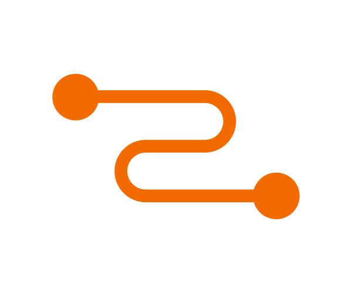

# What is Relay?


"Data-fetching functionality for React applications"


"A framework for building data-driven React applications", [facebook.github.io/relay](http://facebook.github.io/relay)

... on top of GraphQL


@facebook: "Relay drives some React apps, and reduces lots of code on server and client side."

(open source since 2015)


* **Colocation**

* **Declarative**

* **Mutations**


# Co-locating
```javascript
class Tea extends React.Component {
    render() {
        let {name, steepingTime} = this.props.tea;
        return (<li key={name}>
            {name} (<em>{steepingTime} min</em>)
          </li>);
    }
}
export default class Relay.createContainer(Tea, {
    fragments: {
        tea: () => Relay.QL`
          fragment on Tea {
            name,
            steepingTime,
          }
        `, // ES6 template String
    }
});
```


# Co-locating
Each component specifies the data it needs
+ Less context changes while developing frontend
+ New colleagues get easily into it.
+ Less breaking code (checks, tooling)


# Declarative:
_UI defines **what data** it needs_


## Relay/GraphQL can do all the heavy weighting:

* auto query validation
* auto query composition
* render when data fully loaded
* batch data queries efficiently (N+1 problem)
* less dependencies of server-client
* no more over-fetching and under-fetching


## And it does even more:
* Client-side store / cache
  * mutate data on client + server and everything
  * only load data once per batch load


## Mutations
* change data on client and server...
[IMG] TBD

* optimistic / error handling / batching ... all built-in.
[code example TBD]
[IMG] TBD


## Relay App building blocks / layers
[IMG]
 1. queued data: optimistic data
 1. store data: server
 1. cached data

[Code examples]
TBD


## How Relay extends Flux architecture:
DataFetching: Relay Store = client-side cache (normalized, flattened graph representation

TBD


## Further slides and more details about: TBD
* Paging: ~ graphql range for pagination/
* Optimize data-fetching: deferred fragments

[code example TBD]
* GraphQL schema Relay compatible
* How to generate Relay code from GraphQL Schema

