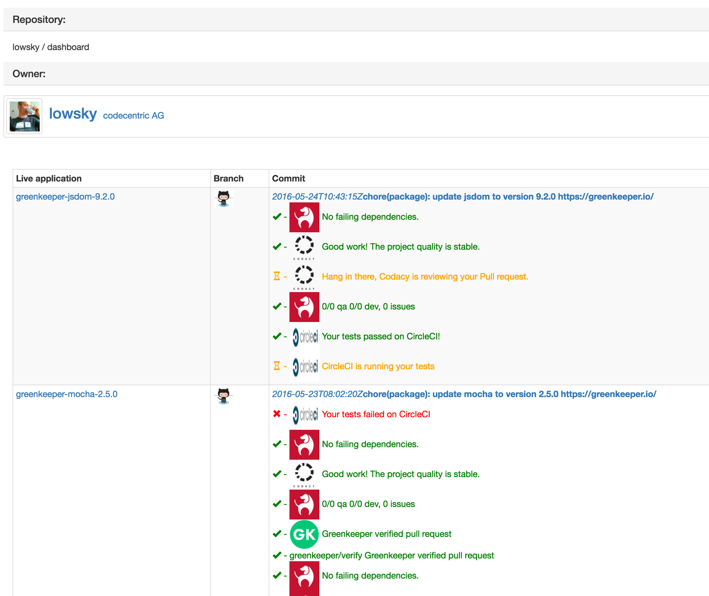
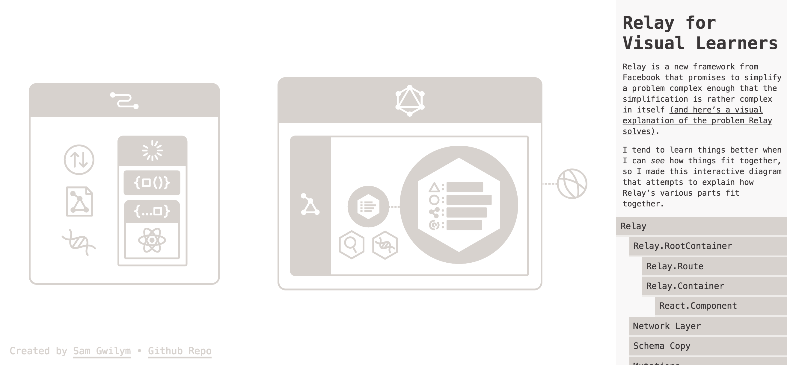
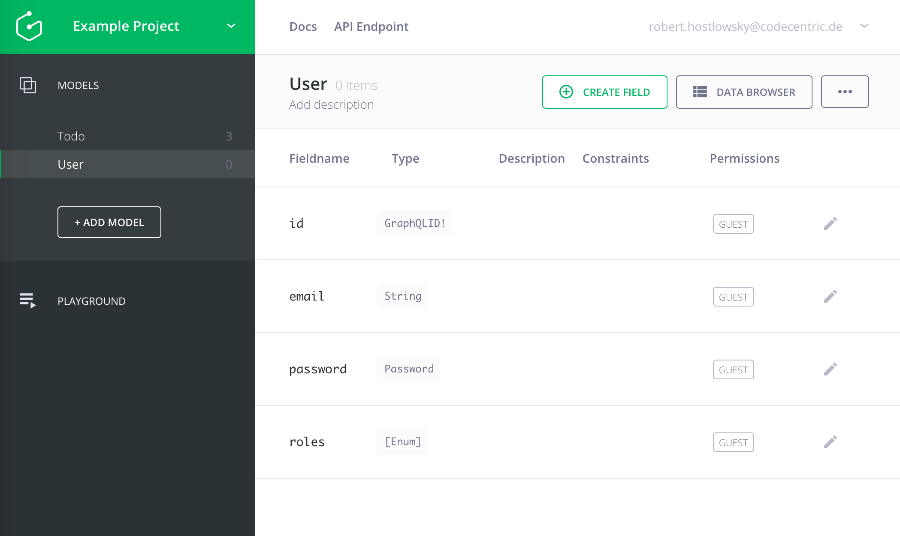

# What is Relay?
  <!-- .element: style="height:12em" -->


> "A **framework** for building data-driven React applications", [facebook.github.io/relay](http://facebook.github.io/relay)

... on top of GraphQL


> "Relay drives some React apps, and **reduces lots of code** on server and client side."
>
> @facebook

open source since 2015


## Main features
* **Co-location**

* **Declarative style**

* **Mutations handling**


# Co-locating
```javascript
class MailUser extends React.Component {
    render() {
        let {name, email} = this.props.user;  // fragment's name
        return (<li key={ name }>
            { name } <a href={ 'mailto:' + email }>send mail</a>
          </li>);
    }
}
export default Relay.createContainer(MailUser, {
    fragments: {
        user: () => Relay.QL`
          fragment on User {
            name
            email
          }
        ` // ES6 template String
    }
});
```


All important information on one place  
* Less context changes
* New colleagues get easily into it
* Tool support


# Declarative style
_UI defines **what data** it needs_
* No more **over-fetching** and **under-fetching**
* eslint plugin
* auto query validation

_Relay/GraphQL can do **all the heavy lifting**_
* wait until all data is fully loaded
* Auto query composition -> **Demo**
* Batch data queries efficiently (N+1 problem)

Note:
* Less dependencies of server-client
## And it does even more:
* Client-side store / cache
  * only load data once per batch load
## One Relay Store - caching, Mutations


### DEMO: github branch ci status

https://github.com/lowsky/dashboard/tree/graphql-relay



## How Relay extends Flux
**Relay Store** = client-side cache

(normalized, flattened graph representation)


# Mutations
Changing data on client and server


All built-in: Optimistic update / Error handling / Batching


## Uncovered
* Mutations in relay
* Facebook **data-loader** for optimized loading...
* babel-plugin
* paging support per "Connection"


## Ecosystem, tools:


### [Apollo stack](http://docs.apollostack.com/)

 [apollo-meteor-stack](http://docs.apollostack.com/#Meteor-Examples)

 [apollo-angular2](http://docs.apollostack.com/apollo-client/angular2.html)

 [apollo-react-redux](http://docs.apollostack.com/apollo-client/redux.html)


## More tools
* [Comparing Redux and Relay](https://www.reindex.io/blog/redux-and-relay)
* [IntelliJ/Webstorm graphql/relay plugin](https://plugins.jetbrains.com/plugin/8097)

* [awesome relay list by Brooklyn Zelenka](https://github.com/expede/awesome-relay)


* [Relay for visual learners](http://sgwilym.github.io/relay-visual-learners)



## Ecosystem - cloud providers:
[Reindex - Instant GraphQL Backend for Relay](https://www.reindex.io/)


[graph.cool : Build a client on top of graphql + relay](https://graph.cool)



## Summary

* In production at facebook
* React Native
* Server side rendering
* Future: 
 * subscriptions
 * optimize for fast user feedback

Note:+
* Looks simple but you might have _difficult problems_, e.g.
  * graphql schema: _ids_ were no "strings"
  * Root-Query: - babel transformation: no string substitution enabled