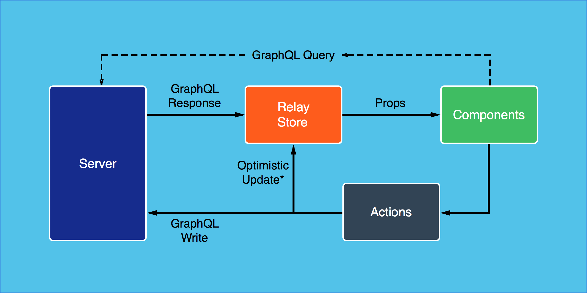

# What is Relay?
  <!-- .element: style="height:12em" -->


> "A **framework** for building data-driven React applications"
> [facebook.github.io/relay](http://facebook.github.io/relay)

... on top of GraphQL


> "Relay drives some React apps, and **reduces lots of code** on server and client side."
>
> @facebook

open source since 2015


## What is it for?

* Data-fetching
* Caching
* Pagination
* Optimistic UI


## Main features
* **Co-location**

* **Declarative style**

* **Mutations handling**


# Co-locating
```javascript
class MailUser extends React.Component {
    render() {
        let {name, email} = this.props.user;  // fragment's name
        return (<li>
            { name } <a href={ 'mailto:' + email }>send mail</a>
          </li>);
    }
}
export default Relay.createContainer(MailUser, {
    fragments: {
        user: () => Relay.QL`
          fragment on User {
            name
            email
          }
        ` // ES6 template String
    }
});
```


### DEMO: spotify client

<a href="http://localhost:3000/playlists" data-preview-link="true">Spotify Client</a>


# Declarative style
_UI defines **what data** it needs_
* No more over-fetching and under-fetching
* Auto code checks, e.g. eslint plugin
* Auto query validation


# Declarative style
_Relay/GraphQL can do **all the heavy lifting**_
* Render when data gets fully loaded
* Auto query-composition -> Demo
* Batch data queries efficiently (N+1 problem)

Note:
### DEMO: github branch ci status
https://github.com/lowsky/dashboard/tree/graphql-relay


Notes:
## How Relay extends Flux
**Relay Store** = client-side cache

(a normalized, flattened graph representation)



## Uncovered features
* Mutations in relay -> Demo?
* Facebook **data-loader** for optimized loading on server-side ...
* babel-plugin enriches client-code
* paging support per "RelayConnection" -> Demo?


## Ecosystem, tools:


### [Apollo stack](http://docs.apollostack.com/)

 [apollo-meteor-stack](http://docs.apollostack.com/#Meteor-Examples)

 [apollo-angular2](http://docs.apollostack.com/apollo-client/angular2.html)

 [apollo-react-redux](http://docs.apollostack.com/apollo-client/redux.html)


## More tools
* [awesome relay list by Brooklyn Zelenka](https://github.com/expede/awesome-relay)
* [Relay for visual learners](http://sgwilym.github.io/relay-visual-learners)

