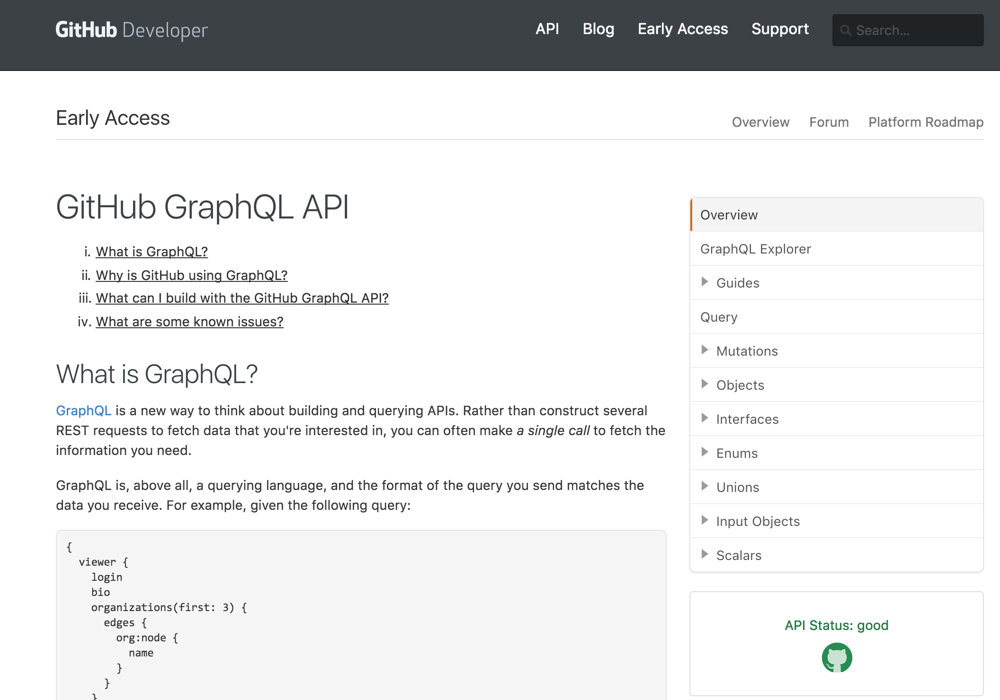

# Wrap-Up

Note:
## alternatives
* Falcor@netflix

## Known limits / risks?
* D.O.S. attack by a complex query

 Solution: Analysis of AST of query complexity

## Should we use it now?
_**Yes!**_

[GitHub announcement](https://developer.github.com/early-access/graphql/)

## Should we migrate?
You _**can**_ run REST and GraphQL **in parallel**!

You _**can**_ migrate step-by-step!
